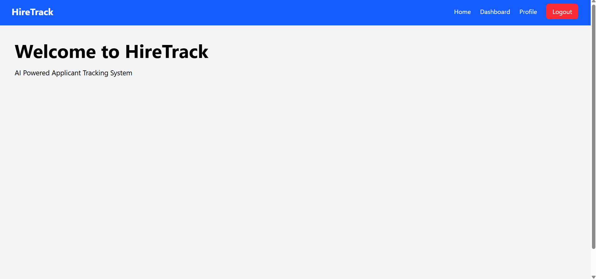
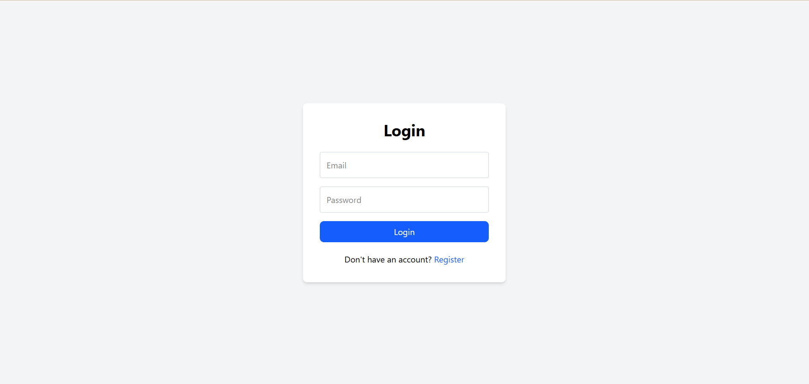
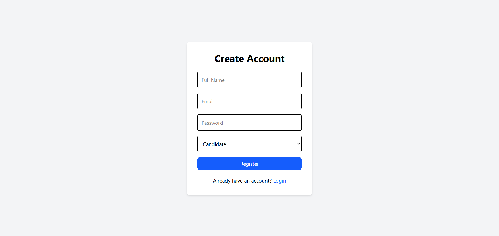
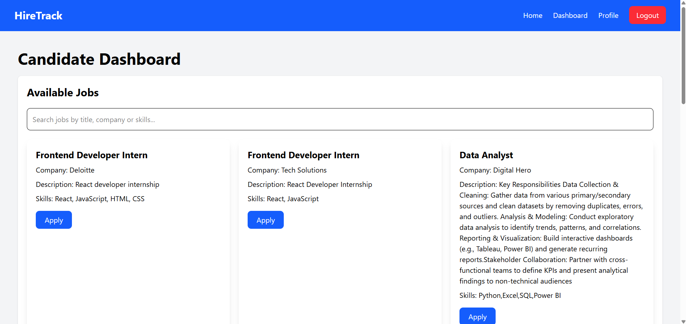
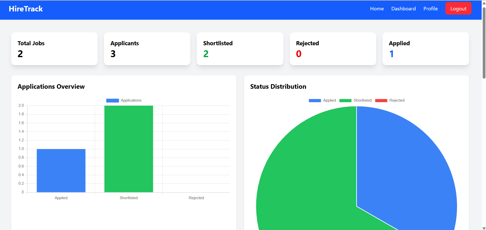
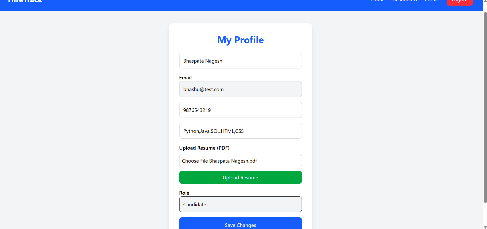
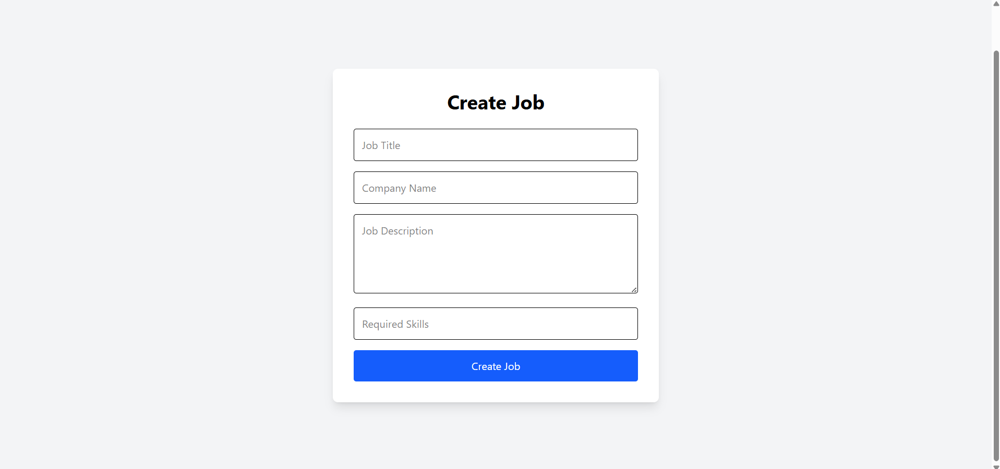
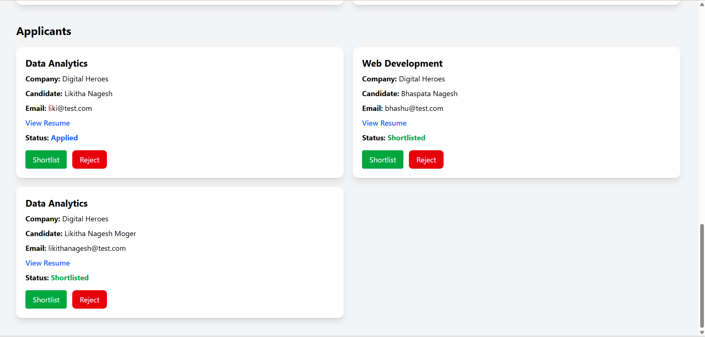

# 🚀 HireTrack ATS

A full-stack **Applicant Tracking System (ATS)** built using the **MERN Stack**. HireTrack ATS helps recruiters manage job postings and applications while enabling candidates to search and apply for jobs, upload resumes, and track their applications through a secure web platform.

---

## 🌟 Features

### 👨‍💻 Candidate Features
- User Registration & Login
- JWT Authentication
- Candidate Profile Management
- Browse Available Jobs
- Search Jobs by Title, Company, and Skills
- Apply for Jobs
- Upload Resume (PDF)
- Track Application Status
- View Personal Profile

### 👩‍💼 Recruiter Features
- Recruiter Registration & Login
- Recruiter Dashboard
- Create Job Postings
- Edit Job Postings
- Delete Job Postings
- View Applicants
- View Candidate Resumes
- Shortlist Candidates
- Reject Candidates
- Application Statistics Dashboard

---

## 🛠️ Tech Stack

### Frontend
- React.js
- JavaScript
- HTML5
- CSS3
- Tailwind CSS
- Axios
- React Router DOM
- Chart.js

### Backend
- Node.js
- Express.js
- MongoDB Atlas
- Mongoose
- JWT Authentication
- Multer
- Cloudinary

### Deployment
- Frontend: Vercel
- Backend: Render
- Database: MongoDB Atlas

---

## 📂 Project Structure

```text
HireTrack-ATS
│
├── client
│   ├── public
│   ├── src
│   │   ├── components
│   │   ├── pages
│   │   ├── context
│   │   ├── App.jsx
│   │   └── main.jsx
│   ├── package.json
│   └── vite.config.js
│
├── server
│   ├── controllers
│   ├── middleware
│   ├── models
│   ├── routes
│   ├── uploads
│   ├── server.js
│   └── package.json
│
└── README.md
```

---

## 🔐 Authentication

HireTrack ATS uses **JWT (JSON Web Token)** for secure authentication and authorization.

### User Roles
- Candidate
- Recruiter

Each role has a dedicated dashboard with role-based access.

---

## ⚙️ Installation & Setup

### Clone the Repository

```bash
git clone https://github.com/likithanagesh38-a11y/HireTrack-ATS.git
cd HireTrack-ATS
```

---

### Backend Setup

```bash
cd server
npm install
```

Create a **.env** file inside the **server** folder.

```env
PORT=5000
MONGO_URI=your_mongodb_connection_string
JWT_SECRET=your_secret_key
CLOUDINARY_CLOUD_NAME=your_cloud_name
CLOUDINARY_API_KEY=your_api_key
CLOUDINARY_API_SECRET=your_api_secret
```

Start the backend:

```bash
npm start
```

---

### Frontend Setup

```bash
cd client
npm install
```

Create a **.env** file inside the **client** folder.

```env
VITE_API_URL=https://hiretrack-ats.onrender.com
```

Run the frontend:

```bash
npm run dev
```

---

## 📸 Screenshots


### 🏠 Home Page



---

### 🔐 Login Page



---

### 📝 Register Page



---

### 👨‍💻 Candidate Dashboard



---

### 👩‍💼 Recruiter Dashboard



---

### 👤 Profile Page



---

### 💼 Create Job


---

### 📋 View Applicants


---

## 🌐 Live Demo

### Frontend
https://hire-track-ats.vercel.app

### Backend API
https://hiretrack-ats.onrender.com

---

## 🚀 Future Enhancements

- AI Resume Screening
- Resume Skill Matching
- Candidate Ranking System
- Advanced Recruiter Analytics Dashboard
- AI Recruitment Assistant

---

## 👩‍💻 Author

**Likitha Nagesh Moger**

Computer Science and Engineering Student

### Skills
- React.js
- Node.js
- Express.js
- MongoDB
- JavaScript
- Python
- SQL

GitHub:
https://github.com/likithanagesh38-a11y

---

## 📄 License

This project is developed for educational, learning, and portfolio purposes.

---

## ⭐ If you like this project

If you found this project helpful, please consider giving it a ⭐ on GitHub.
